# Expense Tracker

## Overview

A multi-user Expense Tracker built with Flask and SQLite.

Users can register, log in, manage expenses, update profiles, and change passwords. Administrators can view users and all expenses through an admin dashboard.

---

## Features

### Authentication

- User Registration
- User Login
- Logout
- Password Hashing
- Session Management

### Expense Management

- Add Expense
- View Expenses
- Update Expense
- Delete Expense
- Filter Expenses
- Category Summary
- Total Expense Summary

### Profile

- View Profile
- Edit Profile
- Change Password

### Admin

- View Users
- View User Expenses
- Delete Users
- Role-based Access Control

---

## Tech Stack

- Python
- Flask
- SQLite
- HTML
- CSS
- Jinja2

---

## Concepts Learned

- Flask Routing
- Jinja Templates
- SQLite CRUD
- SQL JOINs
- Foreign Keys
- Sessions
- Password Hashing
- Decorators
- Blueprints
- Role-Based Authentication

---

## Project Structure

project/
├── app.py
├── database.py
├── handlers.py
├── validate.py
├── decorators.py
├── routes/
│ ├── auth.py
│ ├── expense.py
│ ├── admin.py
│ └── profile.py
├── templates/
└── static/

---

# Screenshots
## SIGNUP
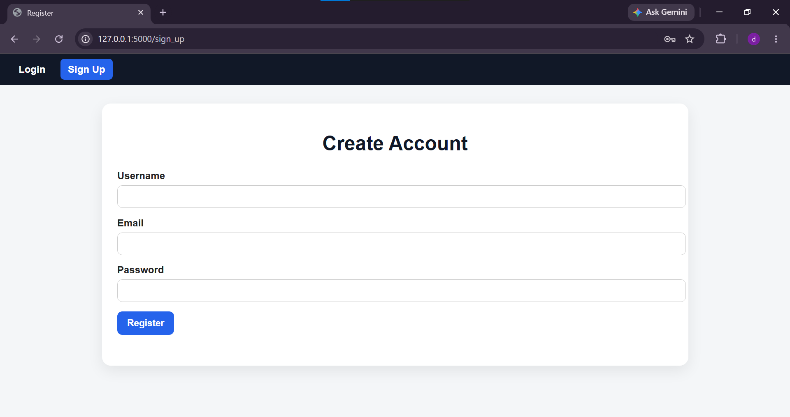
## SIGNUP INVALID HANDLEING
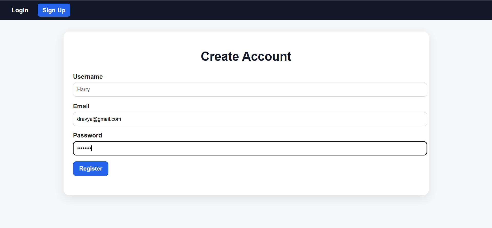
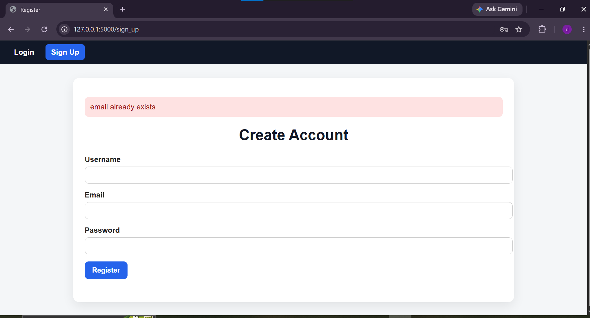

## LOGIN
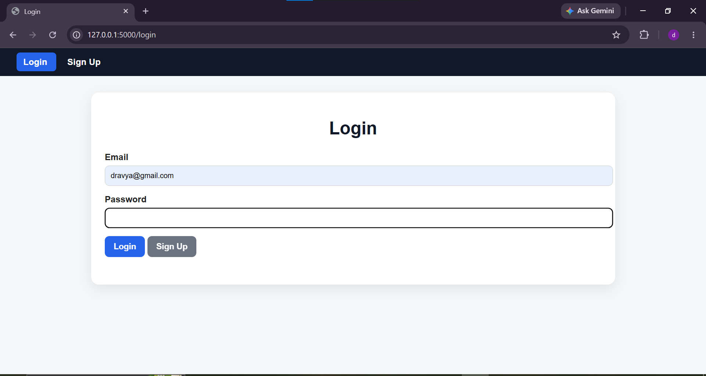
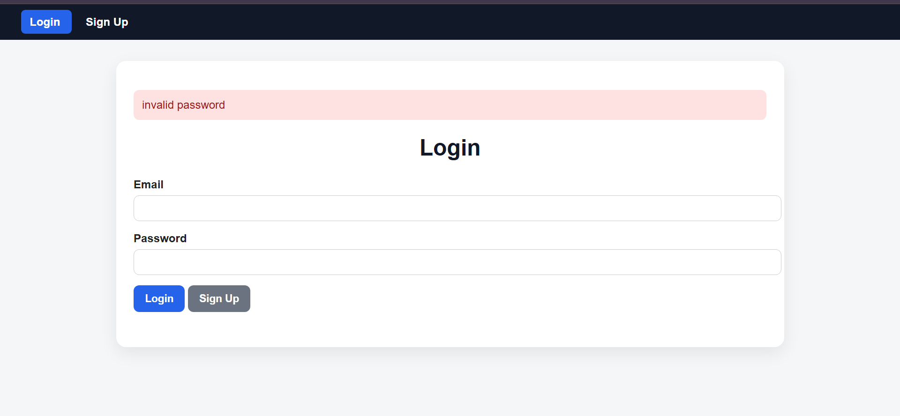

## DASHBOARD
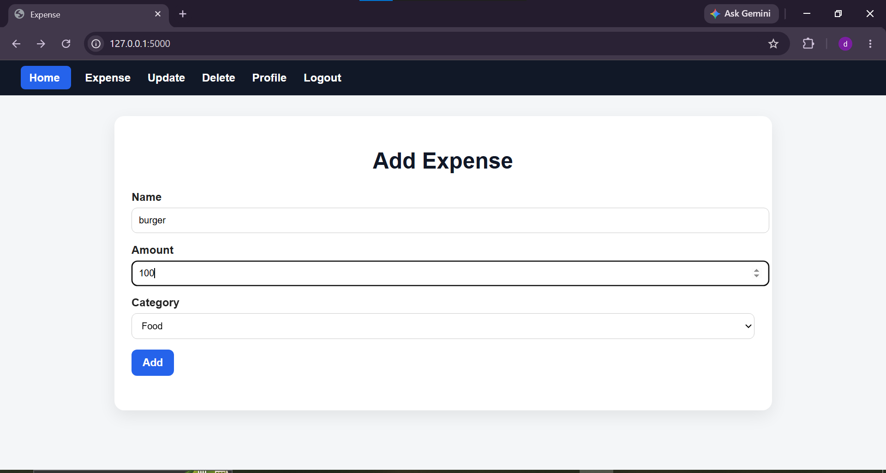
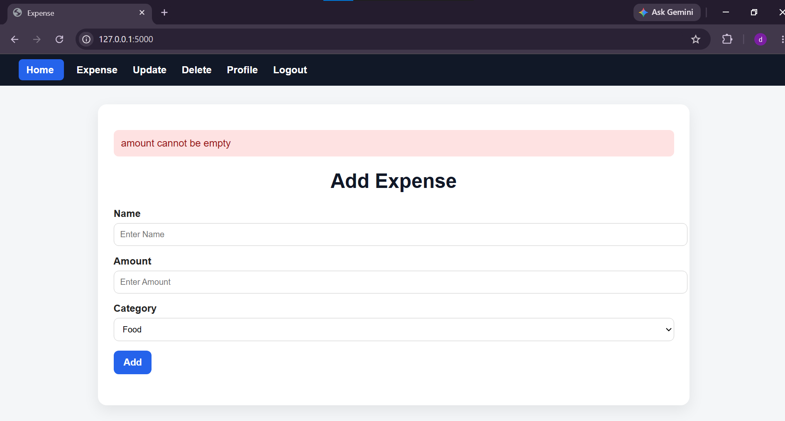

## VIEW EXPENSES AND OPERATION

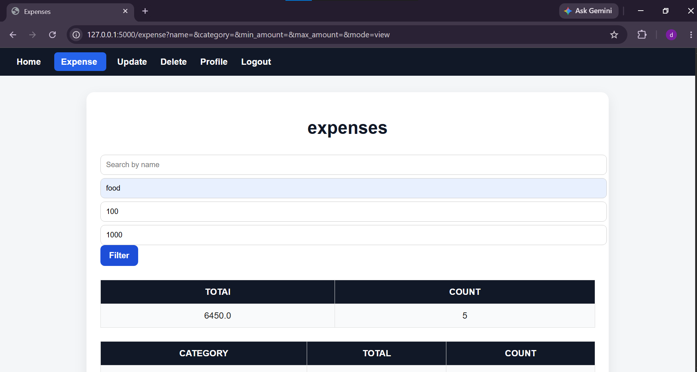
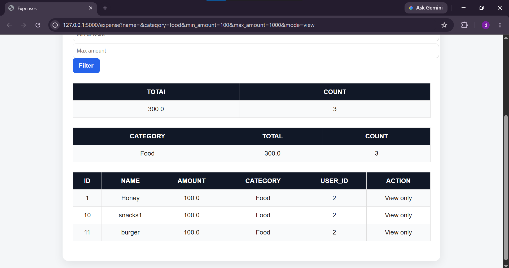
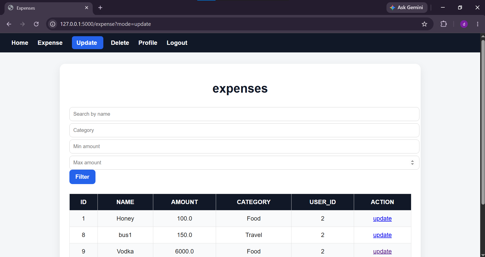
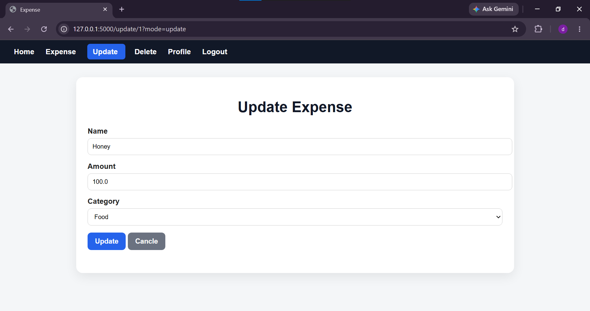
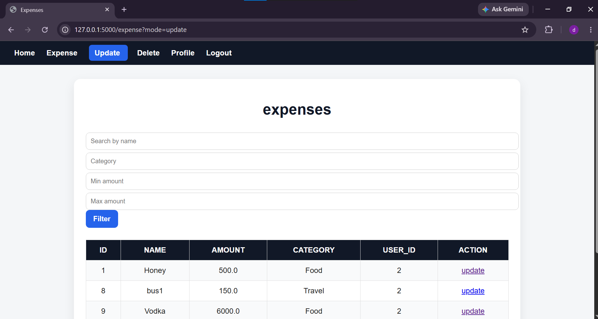
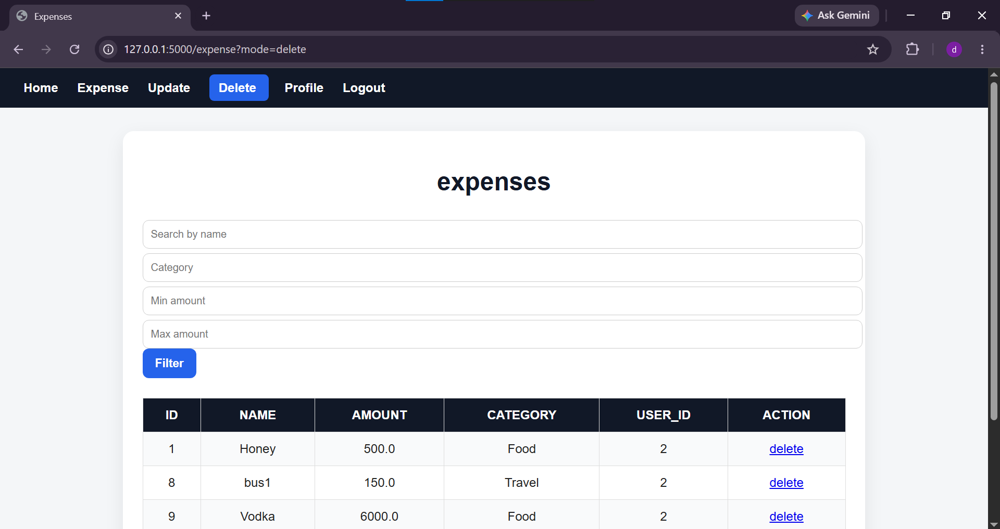
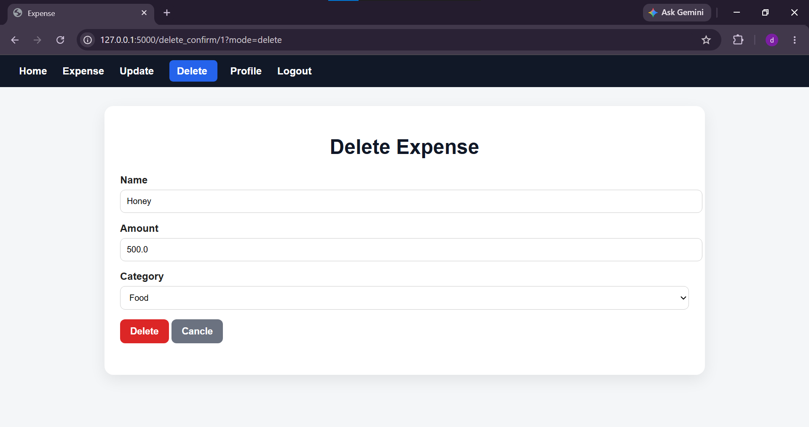
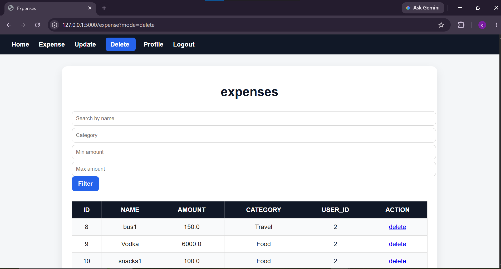

# ADMIN
## ADMIN ROUTE
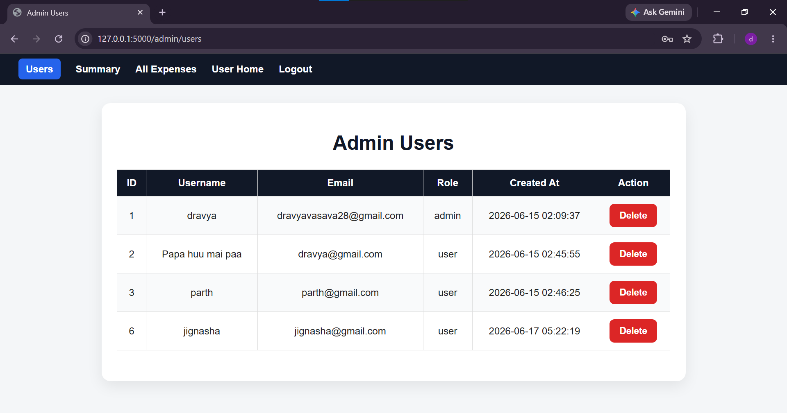
## ADMIN SAUMMARY
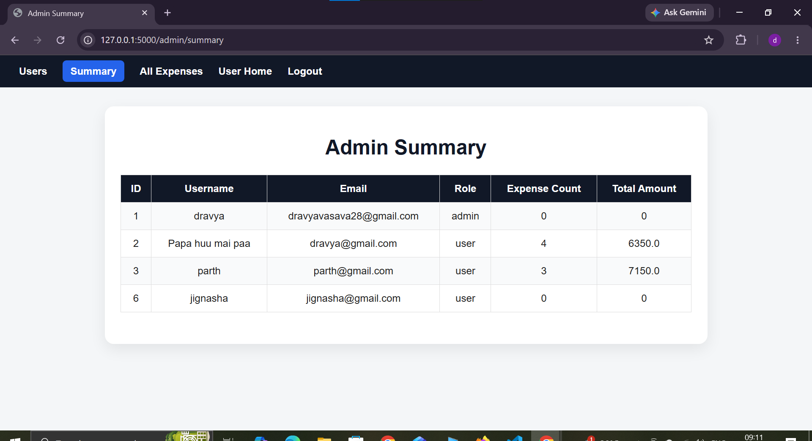
## ADMIN USER ALL EXPENSES

---

## How To Run

1. Clone repository
2. Create virtual environment
3. Install Flask

pip install flask werkzeug

4. Run application

python app.py

5. Open browser

http://127.0.0.1:5000